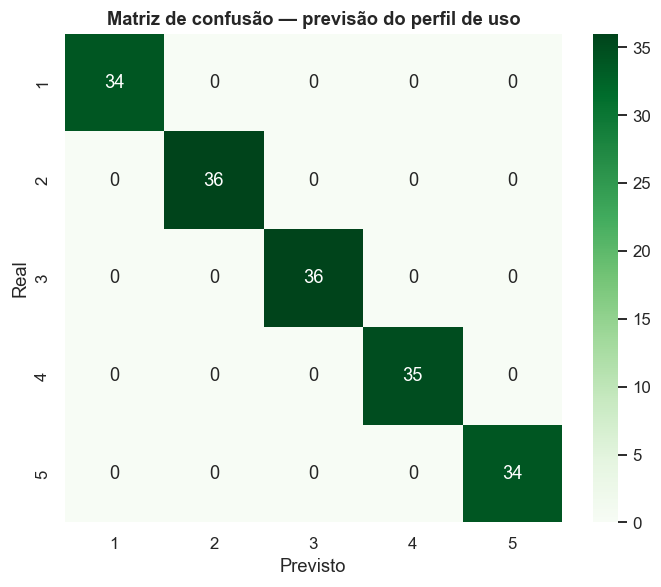
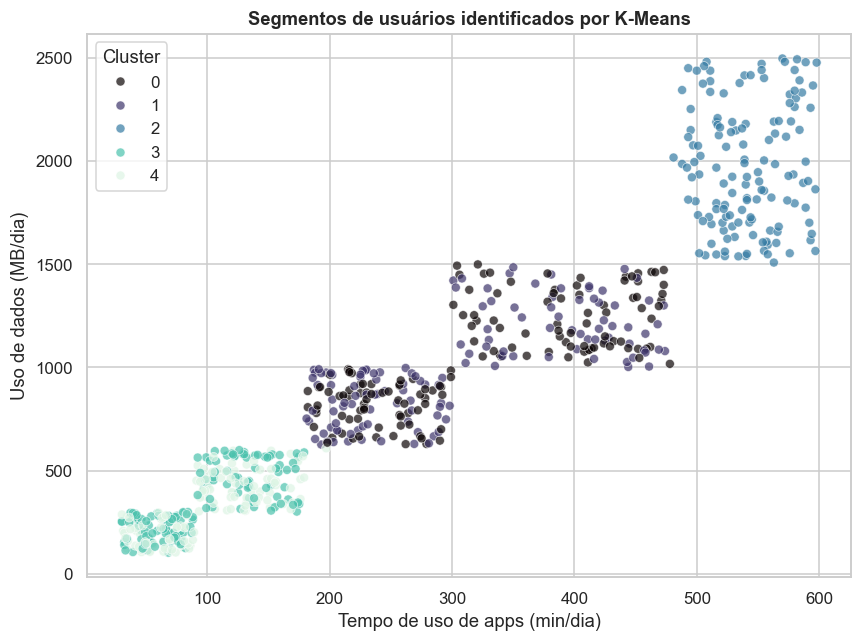

# 📱 Análise de Comportamento de Uso de Smartphones

> Um estudo de dados **end-to-end** sobre padrões de uso de dispositivos móveis — da limpeza à modelagem preditiva — combinando **estatística inferencial**, **regressão**, **classificação supervisionada** e **clusterização**, com forte ênfase em **leitura crítica dos resultados**.

<p align="left">
  
  
  
  
  
  
  
  
</p>

---

## 👤 Autor

**Gustavo Caldeira** — Analista de Dados

[](https://www.linkedin.com/in/gustavocaldeirads)
[](mailto:gustavocaldeirads@gmail.com)

---

## 📌 Contexto do problema de negócio

Operadoras, fabricantes de smartphones e desenvolvedores de apps têm um interesse comum: **entender como as pessoas realmente usam seus celulares**. Saber o que dirige o consumo de bateria, quem são os "usuários pesados" e se há diferenças entre plataformas permite decisões sobre otimização de apps, planos de dados e segmentação de marketing.

Este projeto parte de uma base de **700 usuários** com métricas diárias de uso (tempo de app, tempo de tela, consumo de bateria, nº de apps, uso de dados), dados demográficos (idade, gênero) e plataforma (Android/iOS), além de uma **classe de comportamento** de 1 (muito leve) a 5 (muito pesado). Buscamos responder:

- 🔋 **O que mais consome bateria** no dia a dia?
- 🤖🍏 **Android e iOS** geram padrões de uso diferentes?
- 🚻 Homens e mulheres usam o celular de forma diferente? A **idade** importa?
- 🎯 É possível **prever o perfil de uso** a partir das métricas? E **segmentar** os usuários?

---

## 🧪 Metodologia estatística

Progressão estruturada do básico ao avançado, cada etapa em um módulo Python dedicado.

| # | Etapa | Técnicas | Por que foi escolhida |
|---|-------|----------|------------------------|
| 1 | **Limpeza & Preparação** | Padronização de nomes (snake_case), checagem de nulos/duplicatas, *feature engineering* | Padroniza o esquema e cria variáveis derivadas (`data_por_app`, `bateria_por_hora_tela`, faixa etária). |
| 2 | **Estatística Descritiva** | Média, mediana, desvio, CV, **assimetria**, **curtose**, teste de normalidade | Caracteriza a forma de cada distribuição antes de qualquer teste/modelo. |
| 3 | **EDA Avançada** | Outliers por **IQR** e **Z-score**, correlação de Pearson/Spearman, análise bivariada | Compara dois métodos de outlier e mapeia quais métricas se associam ao perfil de uso. |
| 4 | **Estatística Inferencial** | **Teste t de Welch**, **ANOVA**, **Qui-quadrado**, **intervalos de confiança** (t e *bootstrap*) | Testa hipóteses de negócio: diferença entre SOs, entre gêneros, entre classes e independência categórica. |
| 5 | **Modelagem** | **Regressão Linear (OLS)**, **Regressão Logística** (classificação), **K-Means** | Cobre os três paradigmas: explicar (bateria), prever (perfil) e segmentar (clusters). |

---

## 💡 Principais insights

> Resultados obtidos na execução completa do pipeline (`python main.py`).

### 1. 🔋 Bateria é explicada quase inteiramente pelo uso (R² = 0,94)
A regressão OLS prevê o gasto de bateria com **R² = 0,94** no conjunto de teste. Os fatores com efeito estatisticamente significativo (p < 0,001):

| Fator | Efeito no gasto diário | Interpretação |
|-------|------------------------|---------------|
| **+1 hora de tela** | **+55,8 mAh** | maior peso individual |
| **+1 app instalado** | **+12,9 mAh** | apps em segundo plano custam caro |
| **+1 min de uso de app** | **+1,4 mAh** | efeito unitário pequeno, porém consistente |

> `data_usage` e `age` **não** foram significativos (p > 0,05) — o consumo de dados em si não move a bateria depois de controlar tempo de tela e apps.

### 2. 🤖🍏 Android e iOS usam o celular **igual** (resultado nulo honesto)
O **teste t de Welch** para gasto de bateria **não** encontrou diferença significativa (t = −1,07; **p = 0,29**): Android (1.508 mAh) vs iOS (1.589 mAh). O **qui-quadrado** também mostrou que o sistema operacional é **independente** da classe de comportamento (p = 0,66). *Nem toda análise precisa achar diferença — reconhecer a ausência de efeito é parte do rigor.*

### 3. 🚻 Gênero e idade **não** influenciam o uso
- Teste t por gênero: **sem diferença** (p = 0,90) — homens (270 min) e mulheres (272 min) usam praticamente o mesmo.
- Idade tem correlação **nula** com o uso de apps (r = −0,002; p = 0,99).

➡️ O comportamento de uso é **demograficamente neutro**: o que define o perfil é a *intensidade*, não *quem* é o usuário.

### 4. 📊 As métricas separam perfeitamente as classes (ANOVA)
A **ANOVA** é fortíssima (F = 4.555; p ≈ 0): todas as métricas crescem de forma monotônica da classe 1 à 5.

| Classe | Uso de app (min) | Tela (h) | Bateria (mAh) | Apps |
|--------|----------------:|---------:|--------------:|-----:|
| 1 – Muito leve | 60 | 1,5 | 455 | 15 |
| 3 – Moderado | 235 | 5,0 | 1.515 | 50 |
| 5 – Muito pesado | 541 | 10,1 | 2.701 | 89 |

### 5. 🎯 Classificação com 100% de acurácia — e o que isso *de fato* significa
A Regressão Logística previu a classe de comportamento com **acurácia de 1,00**. Em vez de comemorar ingenuamente, o resultado revela um insight metodológico:

> **A `behavior_class` é uma função determinística das métricas de uso.** As variáveis explicam o alvo de forma tão completa (correlações de ~0,97–0,98) que não há ambiguidade a classificar. Em um cenário real, isso seria um alerta de *data leakage*; aqui, confirma que o rótulo foi *engenheirado* a partir das próprias métricas — algo que um analista crítico deve **sinalizar**, não esconder.



### 6. 🧩 K-Means recupera os perfis de uso
A clusterização (silhouette = 0,40; **Adjusted Rand Index = 0,49** vs. classes reais) separou claramente usuários leves (cluster com ~96 min de uso) de pesados (~541 min), reconstruindo de forma não supervisionada a mesma estrutura de intensidade.



---

## 📂 Estrutura do repositório

```
mobile_device/
├── data/
│   ├── raw/user_behavior_dataset.csv   # fonte
│   └── processed/                       # base limpa (gerada pelo pipeline)
├── src/
│   ├── config.py                        # caminhos e parâmetros centralizados
│   ├── data_loader.py                   # 1. carregamento
│   ├── preprocessing.py                 # 2. limpeza + feature engineering
│   ├── descriptive_stats.py             # 3. descritiva (assimetria, curtose, normalidade)
│   ├── eda_advanced.py                  # 4. outliers + correlação + bivariada
│   ├── inferential_stats.py             # 5. teste t, ANOVA, qui-quadrado, IC
│   ├── modeling.py                      # 6. regressão + classificação + K-Means
│   └── visualization.py                 # funções de plotagem
├── notebooks/
│   ├── notebook_de_analise.ipynb        # narrativa importando src/
│   └── notebook_eda_original.ipynb      # EDA original (versão anterior do projeto)
├── reports/figures/                     # gráficos exportados
├── main.py                              # orquestra o pipeline completo
├── requirements.txt
├── .gitignore
└── README.md
```

### 🧱 Decisões de engenharia
- **Modularidade**: carregamento, processamento, análise e visualização separados.
- **Tipagem** e `dataclasses` para resultados estruturados.
- **Configuração central** em `config.py` (sem números mágicos).
- **Reprodutibilidade**: `random_state` fixo e dependências travadas.

---

## 🚀 Como executar localmente

### 1. Clonar
```bash
git clone https://github.com/gustavocaldeirasantos/mobile_device.git
cd mobile_device
```

### 2. Ambiente virtual
**Windows (PowerShell):**
```powershell
py -m venv .venv
.\.venv\Scripts\Activate.ps1
```
**Linux / macOS:**
```bash
python3 -m venv .venv && source .venv/bin/activate
```

### 3. Dependências
```bash
pip install -r requirements.txt
```

### 4. Rodar o pipeline completo
```bash
python main.py
```
Executa todas as etapas, salva a base limpa em `data/processed/` e os gráficos em `reports/figures/`.

### 5. (Opcional) Módulo isolado
```bash
python -m src.inferential_stats
python -m src.modeling
```

### 6. (Opcional) Notebook
Abra `notebooks/notebook_de_analise.ipynb` no VS Code/Jupyter e selecione o kernel do `.venv`.

---

## 🛠️ Tecnologias

`Python` · `Pandas` · `NumPy` · `SciPy` · `statsmodels` · `scikit-learn` · `Seaborn` · `Matplotlib`

---

## 📜 Licença

Distribuído sob a licença **MIT**.

---

<sub>📊 Projeto de portfólio — análise de dados com fundamentação estatística. Dataset público de comportamento de uso de dispositivos móveis.</sub>
